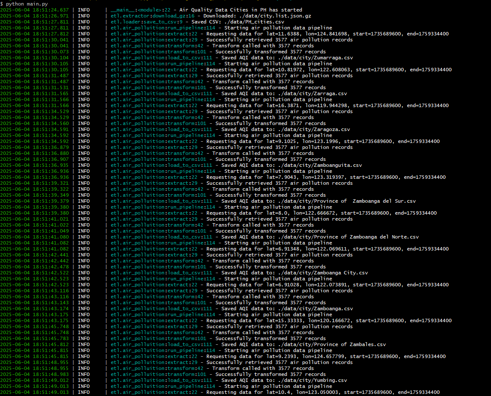

# Air_Quality_Data_PH



A Python ETL pipeline for collecting and processing air quality data from cities across the Philippines using the OpenWeatherMap API.

## Description

This project extracts air quality data for Philippine cities from January 1, 2025 to June 1, 2025. It downloads a comprehensive list of cities from OpenWeatherMap's bulk data, filters for Philippine cities, and then collects historical air pollution data for each location.

## Features

- **Automated City Discovery**: Downloads and processes OpenWeatherMap's city list to identify all Philippine cities
- **Historical Air Quality Data**: Collects air pollution data including PM2.5, PM10, CO, NO2, O3, SO2, and NH3 levels
- **ETL Pipeline**: Complete Extract, Transform, Load pipeline with proper error handling and logging
- **CSV Output**: Saves processed data in CSV format for easy analysis
- **Comprehensive Logging**: Detailed logging for monitoring and debugging

## Data Sources

- **City List**: OpenWeatherMap bulk city list (`http://bulk.openweathermap.org/sample/city.list.json.gz`)
- **Air Quality Data**: OpenWeatherMap Air Pollution API
- **Time Period**: January 1, 2025 - June 1, 2025
- **Geographic Scope**: Philippines (PH)

## Project Structure

```
Air_Quality_Data_PH/
├── main.py                 # Main execution script
├── README.md              # This file
├── requirements.txt       # Python dependencies
├── data/
│   ├── city.list.json.gz  # Downloaded city list
│   ├── PH_cities.csv      # Filtered Philippine cities
│   └── city/              # Individual city air quality data
├── etl/
│   ├── extractor.py       # Data extraction logic
│   ├── transformer.py     # Data transformation logic
│   ├── loader.py          # Data loading logic
│   └── air_pollution.py   # Air pollution data handler
└── logs/
    ├── std_out.log        # Info logs
    └── std_err.log        # Error logs
```

## Installation

1. **Clone the repository**:

   ```bash
   git clone <repository-url>
   cd Air_Quality_Data_PH
   ```

2. **Install dependencies**:

   ```bash
   pip install -r requirements.txt
   ```

3. **Set up API Key**:

   - Get a free API key from [OpenWeatherMap](https://openweathermap.org/api)
   - Replace the API key in `main.py`

4. **Create directories**:
   ```bash
   mkdir -p data/city logs
   ```

## Usage

Run the main pipeline:

```bash
python main.py
```

The pipeline will:

1. Download the city list from OpenWeatherMap
2. Extract and filter Philippine cities
3. Save the city list to `./data/PH_cities.csv`
4. For each city, collect air quality data and save to individual CSV files in `./data/city/`

## Configuration

Key configuration variables in `main.py`:

```python
URL = "http://bulk.openweathermap.org/sample/city.list.json.gz"  # City list source
GZ_PATH = "./data/city.list.json.gz"                            # Download path
CITY_CSV = "PH_cities.csv"                                      # Philippine cities output
API_KEY = "your-api-key-here"                                   # Your OpenWeatherMap API key
COUNTRY_CODE = "PH"                                             # Country filter
START_TIMESTAMP = 1735689600                                    # Jan 1, 2025 (Unix timestamp)
END_TIMESTAMP = 1759334400                                      # Jun 1, 2025 (Unix timestamp)
```

## Data Output

### City List (`PH_cities.csv`)

Contains filtered Philippine cities with:

- `name`: City name
- `lat`: Latitude
- `lon`: Longitude
- `country`: Country code (PH)

### Air Quality Data (`./data/city/{city_name}.csv`)

For each city, contains historical air quality measurements:

- `Date`: Timestamp of measurement
- `co`: Carbon monoxide (μg/m³)
- `no`: Nitrogen monoxide (μg/m³)
- `no2`: Nitrogen dioxide (μg/m³)
- `o3`: Ozone (μg/m³)
- `so2`: Sulfur dioxide (μg/m³)
- `pm2_5`: PM2.5 particles (μg/m³)
- `pm10`: PM10 particles (μg/m³)
- `nh3`: Ammonia (μg/m³)

## Dependencies

- `requests`: HTTP requests for API calls
- `pandas`: Data manipulation and analysis
- `loguru`: Advanced logging
- `gzip`: Decompression of downloaded files
- `json`: JSON data processing

## API Limits

- OpenWeatherMap free tier: 1,000 calls/day
- Consider upgrading for larger datasets
- The pipeline includes error handling for API rate limits

## Logging

The application creates comprehensive logs:

- `logs/std_out.log`: General information and progress
- `logs/std_err.log`: Errors and warnings
- Console output: Real-time progress monitoring

## Error Handling

The pipeline includes robust error handling:

- API request failures
- Data parsing errors
- File I/O operations
- Network connectivity issues

## Contributing

Feel free to submit issues and enhancement requests!

## License

This project is open source and available under the [MIT License](LICENSE).

## Credits

**Author**: Ikigami - Franz Monzales  
**Data Source**: OpenWeatherMap API  
**Project**: Air Quality Data Collection for Philippine Cities

## Contact

For questions or support, please contact ikigamidevs@gmail.com

---

_Last updated: June 2025_
